## Unity环境下的低代码化插件

本插件的灵感来自于FairyGUI的控制器，目的是为程序人员隔离一部分表现逻辑，并为非程序人员提供了较大程度的游戏逻辑编辑能力，并且扩展十分方便。  
本插件在Unity2021.3.29版本上开发，但与Unity版本相关性不大。
本插件共分为状态控制器、进度控制器、执行器和监听器4个部分：  
* 状态控制器：控制子节点的某些属性，将其以若干个状态的形式记录，然后重现出来。  
  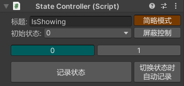  
* 进度控制器：将子节点的某些属性与进度进行映射，当进度变化时，这些属性跟随变化。  
  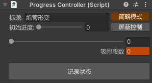  
* 执行器：执行某些变化，播放声音动画等。  
  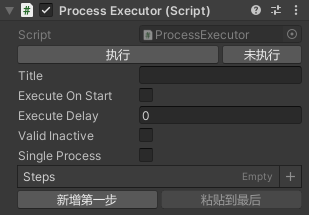  
* 监听器：监听一些MonoBehaviour的消息函数和输入事件等。  
    

## 依赖的框架或插件

* **Odin：** 因为一些体验上的区别，本插件面板绘制逻辑，部分依赖了Odin插件，如只读、条件显示等，另外Odin修改过的列表支持复制插入等操作，也提高了使用本插件的体验。如果觉得本插件用起来还算顺手，还请购买正版Odin。
* **DOTween：** 本插件提供的补间动画都是调用了DOTween的接口，另外本插件也支持对DOTween组件的属性控制。如果觉得本插件用起来还算顺手，还请购买正版DOTween。
* **UGUI：** DOTween支持了UGUI，所以也依赖了UGUI，本插件也支持部分控制UGUI的功能。不需要UGUI的项目，请自行根据报错信息删除相关代码。
* **TextMeshPro：** 本插件支持了对TMP_Text的控制，TextMeshPro的其他组件可以参考其进行扩展，如果不需要TextMeshPro，请自行根据报错信息删除相关代码。

## 示例说明

示例所有内容都在 [Assets/Tools/ControlSystem/Demo](Assets/Tools/ControlSystem/Demo) 目录下。  

* [示例里的UI场景](Assets/LuaBehaviour/Demo/Scenes/UI.scene) 展示了状态控制器在UI上的几种用法：
  * **多语言：** 在一个界面中添加一个状态控制器，将每一种语言设置为一个状态，所有语言相关的UI控件都受到该控制器控制，通过切换状态，改变文本内容、文字大小、图片显示等，另外，切换状态时还能关联执行器，执行一段动画。  
    另外，可以新建一个类继承这个状态控制器，并实现初始化时判断当前语言，监听语言变化时切换状态，然后编辑每个界面时都添加上这个类，即可实现多个界面同步进行多语言切换。  
    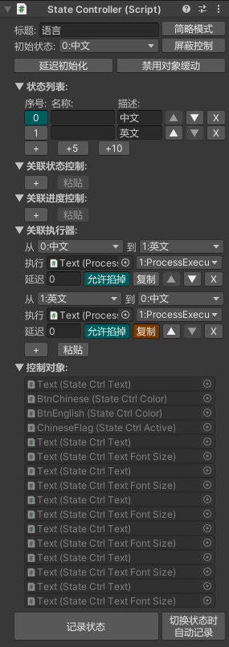   
    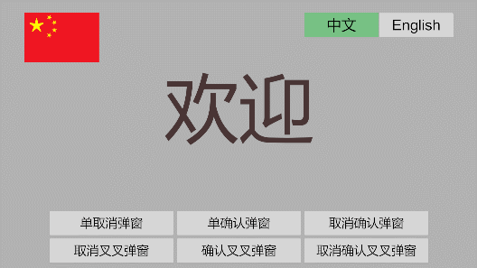  
  * **复用界面的多种状态：** 在开发过程中，我们往往会制作一个通用的系统对话框，在不同时机显示不同的按钮，然后传入文案，响应用户操作。状态控制器可以将每一种按钮方案记录成一种状态，之后只要选择某一状态，即可重现按钮方案。  
    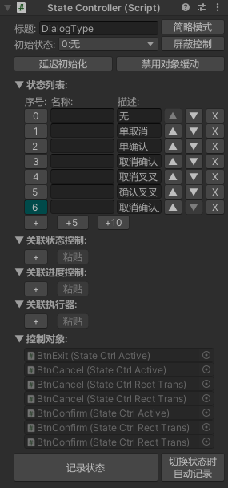  
      
  * **实现补间动画：** UI界面中会有许多弹出窗口或滑出面板，通常我们需要事先编辑动画、声明状态，然后运行时判断状态、调用动画。利用状态控制器，我们可以设置隐藏和显示这两种状态，然后勾选补间动画，运行时只需要改变状态，就能实现界面的淡入淡出。  
    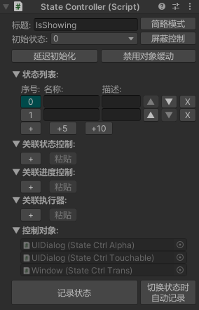  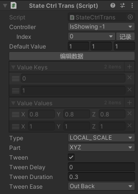  
      
* [示例里的第一人称控制场景](Assets/LuaBehaviour/Demo/Scenes/FirstPerson.scene) 展示了监听器如何配合控制器实现期望逻辑：  
    
  <font color=orange>**本示例只是展示了一种可能性，如果只需要实现简单控制则可以这么做，如果是做比较复杂的第一人称控制，请用Unity自带的第一人称模块。**</font>  
  * **角色移动：** 示例通过监听摇杆状态实现角色移动。示例新增了一个提供角色持续移动的脚本，监听器监听横竖两个方向的摇杆状态，通过进度控制器改变移动速度，从而控制角色移动。  
    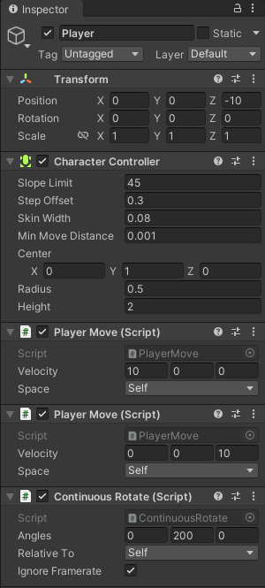 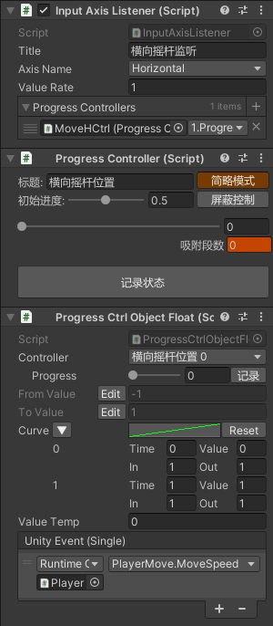  
  * **视角横向控制：** 示例通过监听鼠标横向移动实现视角横向控制。示例新增了一个提供物体持续旋转的脚本，监听器监听鼠标横向移动，通过进度控制器改变旋转速度，从而控制角色横向旋转。  
    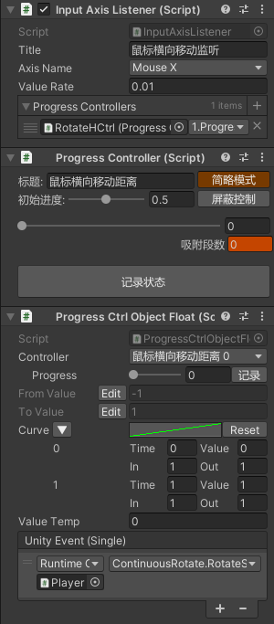  
  * **视角纵向控制：** 由于视角纵向旋转需要设置最大仰角和最大俯角，所以这里先通过一个进度控制器控制摄像机的纵向朝向，然后新增一个提供持续改变进度控制器的脚本，监听器监听鼠标纵向移动，通过另一个进度控制器改变控制器变化速度，从而控制摄像机纵向旋转。  
    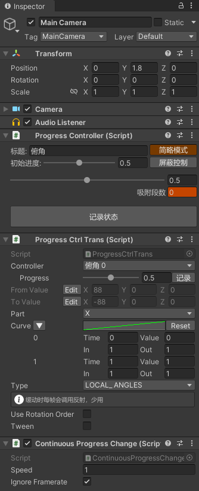 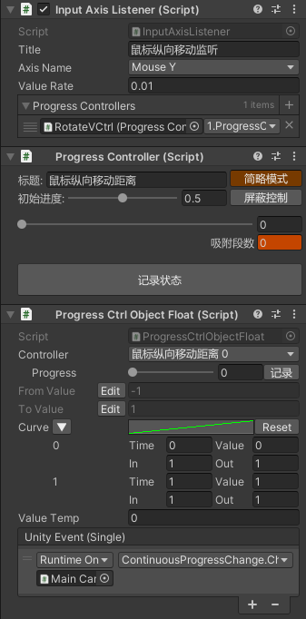  
* [示例里的坦克场景](Assets/LuaBehaviour/Demo/Scenes/FirstPerson.scene) 展示了状态控制器、进度控制器、执行器和监听器如何相互配合：  
  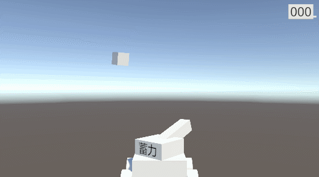
  * **准星与瞄准：** 
    1. 使用执行器，将两个空节点放置在视野左下角和右上角，用来确定视野在世界空间中的范围。
    2. 使用监听器，获取到鼠标位置。
    3. 使用进度控制器，将准星移动到鼠标所对应的世界坐标位置。
    4. 使用执行器，将炮管朝向鼠标所对应的世界坐标位置，并使用监听器不断地调用执行器。
  * **蓄力产生炮管形变：**
    1. 使用进度控制器，控制炮管的形变程度。
    2. 新增一个提供持续改变进度控制器的脚本。
    3. 使用监听器，获取到鼠标左键的按下状态。
    4. 使用状态控制器，根据鼠标按下状态改变进度控制器的变化方向。
  * **发射与炮管恢复：**
    1. 使用监听器，监听鼠标左键的抬起事件。
    2. 使用执行器，在鼠标抬起时，执行播放音效、创建炮弹、恢复炮管缩放等操作。
  * **击毁目标与得分：**
    1. 炮弹飞行轨迹可以用监听器与执行器实现，但为了更真实的物理效果，直接写了一个简单的脚本。
    2. 使用监听器，在子弹收到OnTriggerEnter回调时，调用执行器销毁自身。
    3. 使用执行器，在子弹飞行一段时间后销毁自身。
    4. 使用监听器，在目标收到OnTriggerEnter回调时，调用执行器，广播击中事件、播放音效、销毁自身。
    5. 新增一个计分板脚本，实现分数显示，并提供得分接口。
    6. 使用监听器，监听广播事件，调用计分板得分接口。

## 目录结构

本工程内容可大致分为Odin插件、本框架、示例、DOTween插件、TransformSearch五个部分。

* **[Assets/Plugins/Sirenix](Assets/Plugins/Sirenix)：** Odin插件，没有做任何修改。
* **[Assets/Tools/ControlSystem/Scripts](Assets/Tools/ControlSystem/Scripts)：** 本插件内容。
* **[Assets/Tools/ControlSystem/Demo](Assets/Tools/ControlSystem/Demo)：** 示例内容。
* **[Assets/Tools/Demigiant](Assets/Tools/Demigiant)：** DOTween插件，没有做任何修改。
* **[Assets/Tools/TransformSearch](Assets/Tools/TransformSearch)：** 一个搜索小工具，用于帮助本插件反向查找引用。

## 导入方法

在原工程中准备好Odin插件和DOTween插件（或复制本工程的），将 [Assets/Tools/ControlSystem/Scripts](Assets/Tools/ControlSystem/Scripts) 整个文件夹拷贝到工程中即可。

## 使用方法

* **状态控制器：** 在被控节点或其父节点挂上StateController脚本，然后在被控节点挂上被控属性对应的StateCtrlXXX脚本。
* **进度控制器：** 在被控节点或其父节点挂上ProgressController脚本，然后在被控节点挂上被控属性对应的ProgressCtrlXXX脚本。
* **执行器：** 在任意位置挂上XXXExecutor脚本即可，不过大部分时候，ProcessExecutor就已经满足需求了。
* **监听器：** 除了PhysicsEventListener、Physics2DEventListener、VisibleEventListener需要挂在目标节点上外，其他监听器可以挂在任意位置。

## 使用手册

以下介绍的都是目前已有的脚本，此外使用者还可以自己扩展需要的功能，新增一个BaseStateCtrl、BaseProgressCtrl、执行器和监听器，都是非常方便的。

### 状态控制器

状态控制器以StateController为控制中枢，辅以BaseStateCtrl的一系列派生类。  
代码中想要切换状态，有两种方式，一种是赋值序号，另一种是赋值状态名称。  
```C#
stateController.Index = 1;  // 设置成序号为1的状态

stateController.State = "Chinese";  // 设置成名称为“Chinese”的状态
```
<font color=orange>**为了避免节点间过于复杂的引用关系，我故意限制了StateController只能控制其子节点的BaseStateCtrl。**</font>

#### StateController

**这是StateController简略模式的面板：**  
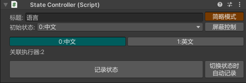  

* **标题：** 标题是用来区分组件的，可以给开发人员看，也可以在别处引用的时候方便区分。  
  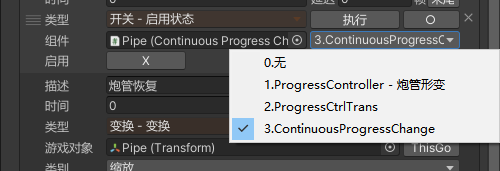  
* **初始状态：** 比如有这么一种情况，某个东西在刚出现的时候，需要隐藏起来，但是编辑的时候需要显示出来编辑，这样的话，每次编辑完成，还需要再把它隐藏回去，如果忘了隐藏，还会产生Bug。所以初始状态很有必要，它会在初始化的时候将所控属性设置为指定状态。
* **「简略模式」复选按钮：** 由于完整的选项比较多，它用于显示和隐藏更多选项。
* **「屏蔽控制」复选按钮：** 编辑时，有时候需要切换到另一个状态而保持属性不变，用来将属性复制到另一个状态中，这时这个按钮就很有用。
* **状态按钮：** 中间的多个按钮，用于显示当前状态和切换状态。
* **关联摘要：** 用于简略地显示关联了什么。
* **「记录状态」按钮：** 用于将所控的所有属性以当前状态记录下来，状态数据会保存在每个BaseStateCtrl中。
* **「自动记录」复选按钮：** 每次编辑完成一个状态后，还需要手动点击一次「记录状态」按钮，显得十分麻烦，这个按钮可以在点击另一个状态按钮前把当前状态记录下来。<font color=orange>**如果启用此功能，编辑完最后一个状态后，别忘了再切一下状态，让最后一个状态被记录下来。**</font>

**这是StateController详情模式的面板：**  
  

* **「延迟初始化」复选按钮：** 有时候我们需要受控对象不在一开始就被控制器控制，开启延迟初始化，初始状态会在第一次状态改变前被赋值。
* **「禁用对象缓动」复选按钮：** 有时候我们需要临时禁用受控对象的补间动画，禁用后，所有收该控制器控制的补间动画都不生效。
* **状态列表：** 这里详细展示了各个状态的序号、名称、描述，状态控制器可以直接赋值序号和名称，而描述仅仅只是给开发人员看的。在简略模式下，如果任意状态拥有名称，则全部显示名称，否则全部显示描述。
* **关联列表：** 关联列表有三个，分别用来设置当该控制器发生变化时，其他状态控制器、进度控制器如何变化，哪些执行器该执行。
  * 列表元素第一行是设置触发条件，支持复选状态。  
      
  * 列表元素第二行可以分别拖入状态控制器、进度控制器和执行器。后面跟着的下拉列表会显示出各自的标题，方便区分，未填入标题会显示匿名。
    * 关联状态，可以拖入状态控制器并设置切换到相同序号、相同名称和具体状态。
    * 关联进度，可以拖入进度控制器并设置进度。
    * 关联执行器，可以拖入执行器。
  * 列表元素第三行最左边是延迟，当触发条件满足时，如果需要延迟一段时间再进行变化/执行操作，则可以填入延迟秒数。当延迟大于0时，右边会出现一个允许掐掉复选框，选中后，如果相邻两次触发间隔小于延迟，则上一次触发会被取消。
  * 第三行最右边还有个「复制」按钮，这其实是个单选按钮，列表唯一，点击列表末尾的「粘贴」按钮，选中的元素将被克隆到列表末尾。
* **控制对象：** 这里展示所有受该控制器控制的BaseStateCtrl，由于只有BaseStateCtrl对StateController的引用而没有反向引用，所以这个列表不可修改，只有点击高亮功能。

#### BaseStateCtrl

**BaseStateCtrl是个抽象类，它具有很多不同功能的派生类，这里拿StateCtrlAnimatorTrigger举例。**  
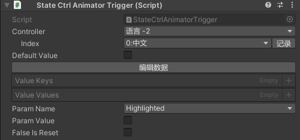  

* **Controller：** 选择受控于哪个控制器，由于限制了只能选父节点的控制器，所以直接以下拉列表的形式展示，每个选项会展示控制器的标题和向上层数。另外，为了方便编辑，这里另起一行展示了控制器当前的状态和记录按钮，该按钮只会记录该BaseStateCtrl控制的属性。
* **Default Value：** 默认值，当某个状态没有记录受控属性的值时，会使用默认值进行赋值。
* **「编辑数据」按钮和键值对列表：** 由于Unity不能序列化真正的字典，所以这里是以键列表和值列表的形式储存状态数据。正常情况下，状态数据应该被记录操作自动生成，而不应该被手动修改，所以默认不可修改，但有时候的确需要手动修改，所以设置了编辑数据复选按钮。
* **其他部分** 剩下的部分是每个派生类独有的变量，比如这里就有三个变量，由于AnimatorController可能被多个Animator使用，所以不太方便直接修改AnimatorController（还是那个问题，修改后容易忘了改回来），于是StateCtrlAnimatorTrigger另外设置了一个缓存变量（Param Value）用于编辑时记录，其他某些派生类也会用到这种方式。

BaseStateCtrl所有派生类的组件右键菜单里有个FillAllStates选项，能以当前属性值将所有状态填满。  
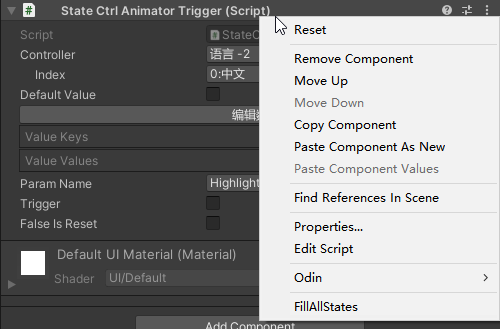  

由于BaseStateCtrl只能储存单一类型的数据，也就是只能控制单一类型的属性，所以一个组件往往需要多个BaseStateCtrl的派生类才能控制所有属性，这也导致了派生类的命名不能按照受控组件命名。如果找不到用于控制目标属性的派生类，可以在代码中搜索一下目标属性名或者查阅 [**BaseStateCtrl派生列表**](BaseStateCtrl派生列表.md) 。

### 进度控制器

进度控制器以ProgressController为控制中枢，辅以BaseProgressCtrl的一系列派生类。  
代码中想要切换进度，只需要对进度进行赋值。  
```C#
progressController.Progress = 0.5F;  // 将进度设置成0.5
```
<font color=orange>**为了避免节点间过于复杂的引用关系，我故意限制了ProgressController只能控制其子节点的BaseProgressCtrl。**</font>  

#### ProgressController

**这是ProgressController简略模式的面板：**  
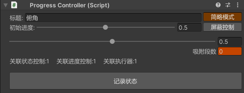  

* **标题：** 标题是用来区分组件的，可以给开发人员看，也可以在别处引用的时候方便区分。
* **初始进度：** 它会在初始化的时候将所控属性设置为初始进度对应的值。
* **「简略模式」复选按钮：** 由于完整的选项比较多，它用于显示和隐藏更多选项。
* **「屏蔽控制」复选按钮：** 编辑时，有时候需要滑动进度而保持属性不变，用来将关键点复制到另一个进度上，这时这个按钮就很有用。
* **进度滑块：** 用于显示当前进度和改变进度。
* **吸附段数：** 某些时候需要离散地控制进度，这里就是在编辑时模拟离散进度赋值的，只在编辑器中生效。
* **关联摘要：** 用于简略地显示关联了什么。
* **「记录状态」按钮：** 用于将所控的所有属性以当前进度记录成关键点，数据会保存在每个BaseProgressCtrl中。

**这是ProgressController详情模式的面板：**  
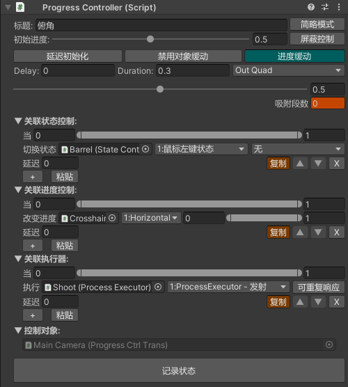  

* **「延迟初始化」复选按钮：** 有时候我们需要受控对象不在一开始就被控制器控制，开启延迟初始化，初始进度会在第一次进度改变前被赋值。
* **「禁用对象缓动」复选按钮：** 有时候我们需要临时禁用受控对象的补间动画，禁用后，所有收该控制器控制的补间动画都不生效。
* **「进度缓动」复选按钮：** 选中时会出现缓动选项，每次赋值会以当前进度为缓动起点，根据缓动参数缓动到目标进度。
* **关联列表：** 关联列表有三个，分别用来设置当该控制器发生变化时，其他状态控制器、进度控制器如何变化，哪些执行器该执行。
  * 列表元素第一行是设置触发条件，在最小进度（包含）和最大进度（包含）之前即触发范围。  
  * 列表元素第二行可以分别拖入状态控制器、进度控制器和执行器。后面跟着的下拉列表会显示出各自的标题，方便区分，未填入标题会显示匿名。
    * 关联状态，可以拖入状态控制器并设置切换到具体状态。
    * 关联进度，可以拖入进度控制器并设置进度映射范围。
    * 关联执行器，可以拖入执行器，若选中「可重复响应」按钮，则每一次进度改变，只要在触发范围内，都会触发一次，若未选中，则需要离开触发范围后重新进入，才会再次触发。
  * 列表元素第三行最左边是延迟，当触发条件满足时，如果需要延迟一段时间再进行变化/执行操作，则可以填入延迟秒数。当延迟大于0时，右边会出现一个允许掐掉复选框，选中后，如果相邻两次触发间隔小于延迟，则上一次触发会被取消。
  * 第三行最右边还有个「复制」按钮，这其实是个单选按钮，列表唯一，点击列表末尾的「粘贴」按钮，选中的元素将被克隆到列表末尾。
* **控制对象：** 这里展示所有受该控制器控制的BaseProgressCtrl，由于只有BaseProgressCtrl对ProgressController的引用而没有反向引用，所以这个列表不可修改，只有点击高亮功能。

#### BaseProgressCtrl

BaseProgressCtrl是个抽象类，它具有很多不同功能的派生类，这里拿ProgressCtrlTrans举例。  

* **Controller：** 选择受控于哪个控制器，由于限制了只能选父节点的控制器，所以直接以下拉列表的形式展示，每个选项会展示控制器的标题和向上层数。另外，为了方便编辑，这里另起一行展示了控制器当前的状态和记录按钮，该按钮只会记录该BaseProgressCtrl控制的属性。
* **From Value/To Value：** 既然是进度映射，那肯定有起始值和结束值，起始值对应进度0，结束值对应进度1，这里控制的是Transform的那几个常见属性，所以是Vector3类型。
* **Part：** 控制向量类型的属性才会有的变量，用于选择控制向量的哪几个分量。
* **Curve：** 映射曲线，用于设置进度和实际属性值的映射关系，选择了几个Part就会有几个Curve。
* **其他部分** 剩下的部分是每个派生类独有的变量，比如这里就有两个变量和缓动开关。

由于BaseProgressCtrl只能储存单一类型的数据，也就是只能控制单一类型的属性，所以一个组件往往需要多个BaseProgressCtrl的派生类才能控制所有属性，这也导致了派生类的命名不能按照受控组件命名。如果找不到用于控制目标属性的派生类，可以在代码中搜索一下目标属性名或者查阅 [**BaseProgressCtrl派生列表**](BaseProgressCtrl派生列表.md) 。

### 执行器

所有执行器都继承BaseExecutor，它是个一体式的组件，只要是想执行的一个或多个命令，都可以封装成执行器。  
代码中想要执行它，只需要调用它的执行函数。
```C#
executor.Execute();  // 执行执行器
```
这里拿LogExecutor举例。  

* **Title：** 标题是用来区分组件的，可以给开发人员看，也可以在别处引用的时候方便区分。
* **Execute On Start：** 勾选后，会自动在Start函数里执行一次。
* **Execute Delay：** 需要延迟多久执行，若大于0，则会开启协程等待一段时间再执行。
* **Valid Inactive：** 默认情况下，如果所在的GameObject的active为false，则不会执行命令，这用于临时禁用执行器。而勾选后，即使所在的GameObject的active为false，也允许执行。<font color=orange>**需要注意的是，如果执行器的enabled为false，则无论如何都不会执行。**</font>
* **其他部分：** 剩下的部分是每个执行器独有的，比如这里就有这么几个属性：
  * Level：日志级别。
  * Message：日志内容。
  * Context：点击日志需要高亮的对象。
  * ShowTime：是否在日志前面加入“[HH:mm:ss.fff]”形式的时间字符串。在Unity编辑器的控制台窗口有自带时间，但是时间只精确到秒，而且打包后就看不到时间了，所以加了这个。

#### ProcessExecutor

其实在大多数时候，我们要执行的并不是单个命令，而是一连串的流程。这里提供了一个执行器的派生类——ProcessExecutor，它能通过协程执行一连串的命令。  
  
ProcessExecutor特有的属性只有2个：
* **Single Process：** 单一流程，勾选后，如果流程尚未执行完毕时再次执行流程，则会先中断上一次流程，再重新执行流程。
* **Steps：** 流程步骤，每一步都拥有描述、时间、类型3个属性。
  * **描述：** 用于描述当前步骤是做什么的，只用来给开发人员看。
  * **时间：** 时间有3个参数，分别数秒数、帧数和帧末尾复选按钮，每个步骤会在指定时间并延迟指定帧数后（或帧末尾）执行，相同时间、延迟的步骤，会根据它在列表中的顺序执行。比如有个步骤是时间为3，延迟为2，选中了帧末尾按钮，则该步骤在3秒后的第2帧帧末尾执行。
  * **类型：** 用于区分不同命令，目前支持一下几种类型：  
      
    如果工程里有 [LuaBehaviour(GitHub)](https://github.com/wy19910222/Unity-LuaBehaviour) / [LuaBehaviour(Gitee)](https://gitee.com/wy19910222/Unity-LuaBehaviour) 的话，会多出3个类型。  
    如果工程里有 [spine-unity](https://github.com/EsotericSoftware/spine-runtimes/tree/4.1/spine-unity) 插件的话，也会多出3个类型。  
    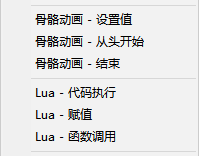  
    不同的步骤类型会有不同的功能与界面，详细说明请查阅 [**ProcessExecutor步骤类型说明**](ProcessExecutor步骤类型说明.md) 。

### 监听器

监听器用于监听MonoBehaviour的消息函数和输入事件等，每个监听器监听的内容不同，但最终都是调用执行器、改变状态控制器状态或改变进度控制器进度。

#### BaseEventListener

BaseEventListener用于监听简单事件并调用执行器。  

* **EnabledEventListener:** 通过改变Type选择监听MonoBehaviour的OnEnable还是OnDisable。  
    
* **UpdateEventListener:** 监听MonoBehaviour的Update，并且可以设置间隔多久调用一次执行器。  
  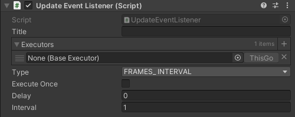  
  * Type：选择按时间间隔还是按帧数间隔。  
  * Execute Once：是否执行一次后就禁用。  
  * Delay：第一次执行前等待时间，如果是时间间隔，则是秒数，如果是帧数间隔，则是帧数。  
  * Interval：间隔时间，如果是时间间隔，则是秒数，如果是帧数间隔，则是帧数。  
* **LateUpdateEventListener:** 与UpdateEventListener大致相同，不同点在于它是在LateUpdate中调用执行器。  
  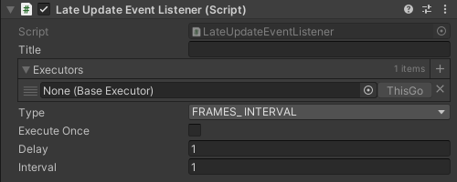  
* **VisibleEventListener:** 通过改变Type选择监听MonoBehaviour的OnBecameVisible还是OnBecameInvisible。  
    
* **PhysicsEventListener:** 通过改变Type选择监听OnTriggerEnter/Stay/Exit还是OnCollisionEnter/Stay/Exit。此外，还对执行做了一些过滤。  
  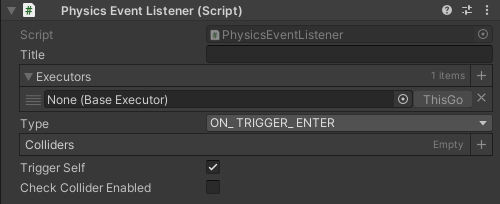  
  * Colliders：如果列表为空，则表示碰到任何碰撞盒都执行，否则，只有碰到列表中的碰撞盒才会执行。  
  * Trigger Self：Unity的OnTriggerEnter/Stay/Exit，只要自己是IsTrigger状态，无论对方是不是IsTrigger状态，都会收到消息。而<font color=orange>勾选了「Trigger Self」后，只有对方是IsTrigger状态才会执行。</font>  
  * Check Collider Enabled：Unity的OnTriggerEnter/Stay/Exit，是先判断好哪些对象会收到消息，然后挨个发送消息。这导致某些时候会出现我们期望之外的效果，比如同时触发了两个OnTriggerEnter，但我在第一个OnTriggerEnter中禁用了碰撞盒，本来是期望第二个OnTriggerEnter不会触发，但是因为Unity已经事先判断好了该不该触发，所以仍然会触发第二个OnTriggerEnter。而<font color=orange>勾选了「Check Collider Enabled」后，只有双方Collider都是启用状态才会执行。</font>  
* **Physics2DEventListener:** 通过改变Type选择监听OnTriggerEnter2D/Stay2D/Exit2D还是OnCollisionEnter2D/Stay2D/Exit2D。  
  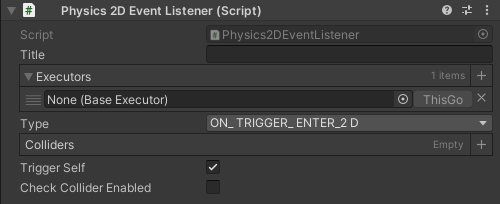  
* **CustomEventListener:** 一个只支持无参的事件分发器，可以用执行器触发事件，也可以调用静态函数「CustomEventListener.Emit」触发。  
    
  * 用执行器触发事件：执行器封装好了触发代码。  
  * 调用静态函数：CustomEventListener本身是个静态的事件分发器，实例向其注册了监听，所以直接调用「CustomEventListener.Emit」也可以触发。  
  * SendMessage触发：也可以利用SendMessage向它所在的GameObject发送消息，消息名为“CustomEvent”，参数为事件名称。  
* **MousePositionListener:** 在Update中将鼠标坐标除以屏幕宽高，赋值给进度控制器。  
  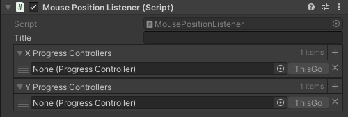  
* **InputButtonListener:** 在Update中将指定名称的按钮的按下状态，赋值给状态控制器，<font color=orange>1表示按下，0表示抬起</font>，并且状态变化时调用执行器，名称在「ProjectSettings/InputManager」里添加，以下拉框的形式选择。  
  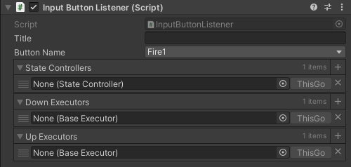  
* **InputAxisListener:** 在Update中将指定名称的轴的值，赋值给进度控制器，名称在「ProjectSettings/InputManager」里添加，以下拉框的形式选择。  
    
